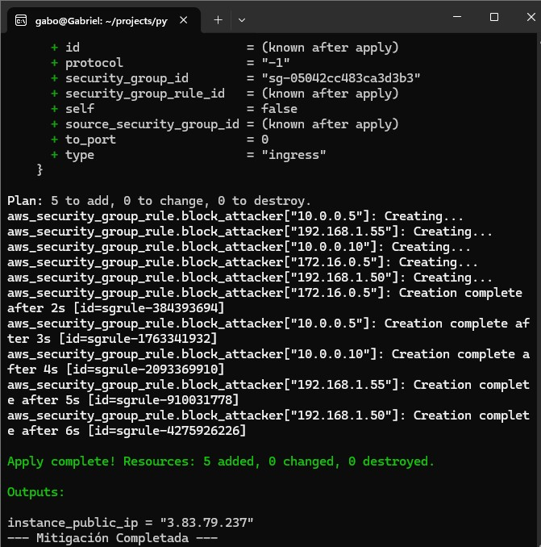
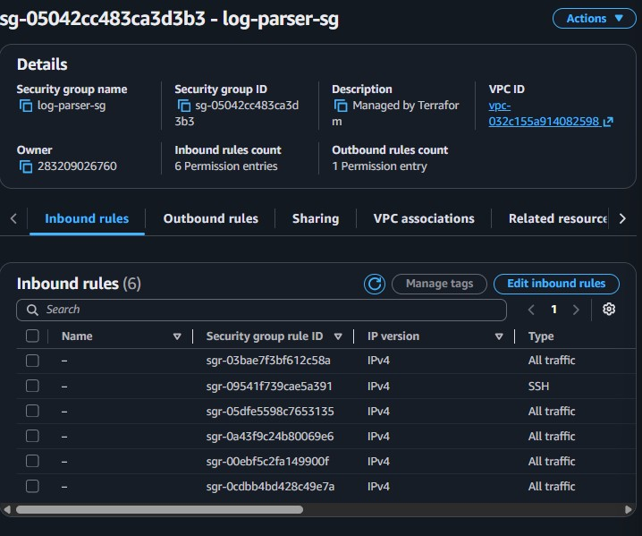

# Python Log Parser

A security detection and incident response system based on log analysis and infrastructure automation (IaC).

## Description
This project implements an automated security agent that monitors server logs in real-time to detect unauthorized access attempts. Upon identifying brute-force patterns, the agent generates a blocklist and utilizes Terraform to dynamically update AWS Security Group rules, autonomously mitigating attack vectors.

## Technology Stack
* **Languages:** Python (Detection Engine), Bash (Process Automation).
* **Infrastructure as Code:** Terraform.
* **Cloud Provider:** AWS (VPC, Security Groups, EC2).
* **Version Control:** Git.

## Pipeline Architecture
The automated workflow follows this logical sequence:
1. **Detection:** Real-time log analysis using the Python Log Parser engine.
2. **Persistence:** Generation of a blocklist file (blacklist.txt).
3. **Orchestration:** Execution of the deployment script (deploy.sh).
4. **Deployment:** Application of changes via terraform apply to update firewall rules in AWS.

## Evidence of Results

### Detection Process

*System output log identifying threats and executing the network update via CLI.*

### AWS Infrastructure Configuration

*Visualization of dynamically created inbound rules within the AWS Security Group console.*

## Installation and Usage

### Prerequisites
* AWS CLI configured with appropriate permissions.
* Terraform installed in the local environment.

### Execution
1. Clone the repository: `git clone <repository-url>`
2. Navigate to the project directory: `cd python-log-parser`
3. Execute the deployment script: `./deploy.sh`

## Technical Considerations
* **State Management:** The project utilizes a blacklist.txt file to maintain persistence of blocked IPs across multiple execution cycles.
* **Security:** The infrastructure deployment follows GitOps principles, ensuring the network state aligns with the configuration defined in the source code.
* **Maintainability:** The use of local variables in Terraform allows for scaling the blocklist without manual intervention in the AWS console.
